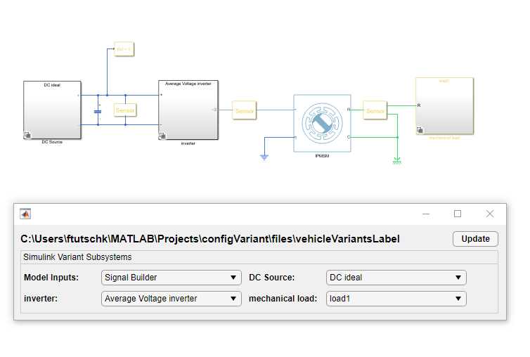

# Configuration UI for Simulink variants
Copyright 2020 The MathWorks, Inc.

This example shows a way to specify variant configurations for Simulink models containing variant subsytems via a User Interface (UI). Simulink variant subsystem elements are listed in popup menus.

variantConfigUI function searches for all variant subsystems in a model and uses set_param to change 'VariantControlModel' and 'LabelModeActiveChoice'. Adding new variants also changes UI size.
Changing a pop up menu's value immediately changes the active variant in the Simulink model.

[VariantConfigAppdoc.html](https://github.com/mathworks/Config-UI-for-Simulink-variants/blob/master/doc/html/VariantConfigAppdoc.html) contains more details.

## Prerequisites

[MATLAB](https://www.mathworks.com/products/matlab.html)
[Simulink](https://www.mathworks.com/products/simulink.html)

The project contains an example using [Simscape](https://www.mathworks.com/products/simscape.html) blocks.

## Getting Started

1. Open project ConfigVariant.prj. The project startup opens the example model and the UI. If you do not have Simscape, open the UI with a Simulink example:

variantConfigUI('sldemo_variant_subsystems');

2. Explore the UI and popup menus.
3. Change selection in popup menus and see adjustments in the model
4. Use variantConfigUI with your own model:

variantConfigUI(yourModel);

